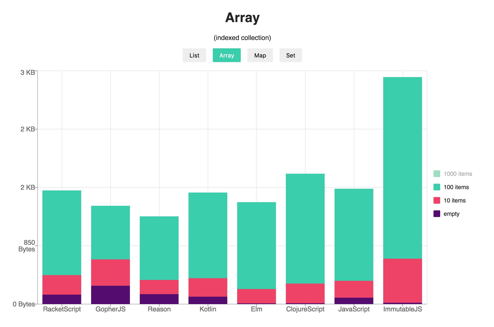

# Data Structures Memory Usage in JavaScript



- [JavaScript](#javascript)
- [ImmutableJS](#immutablejs)
- [ClojureScript](#clojurescript)
- [Kotlin](#kotlin)
- [GopherJS (Go)](#gopherjs-go)
- [RacketScript](#racketscript)
- [Reason (BuckleScript)](#reason-bucklescript)
- [Elm](#elm)
- PureScript
- Dart
- ElixirScript
- Scala.js
- GHCJS (Haskell)
- ...

## How to add stats

_Stats for at least three types of data structures are required:_
- Indexed collection of values such as _Array_ or _Vector_
- Collection that maps keys to values such as _Map_ or _Record_
- Collection of unique values — _Set_


1. See how test code is implemented in other languages
2. Implement test code in lang _X_
3. Put sources in a directory in `src`
4. Write NPM build script using this template: `"build:[lang]": "[build cmd]"`
5. Write NPM test script using this template: `"run:[lang]": "node src/[lang]/test.js > out/[lang].json"`
6. Run test script
7. Add results to `README.md`
8. Submit a PR

## JavaScript
```json
{
  "empty object": 70.192,
  "empty array": 93.04,
  "empty map": 196.32,
  "empty set": 166.64,

  "10 item object": 143.552,
  "10 item array": 246.152,
  "10 item map": 882.304,
  "10 item set": 431.76,

  "100 item object": 6242.864,
  "100 item array": 1341.864,
  "100 item map": 6869.504,
  "100 item set": 2645.504,

  "1000 item object": 98685.52,
  "1000 item array": 11597.864,
  "1000 item map": 60768.392,
  "1000 item set": 20563.264
}
```

## ImmutableJS
```json
{
  "empty list": 19.904,
  "empty map": 23.16,
  "empty set": 23.192,

  "10 item list": 641.752,
  "10 item map": 1901.608,
  "10 item set": 1578.704,

  "100 item list": 2647.36,
  "100 item map": 17411.496,
  "100 item set": 15679.656,

  "1000 item list": 20485.224,
  "1000 item map": 182600.704,
  "1000 item set": 123834.648
}

```

## ClojureScript
```json
{
  "empty list": 8.936,
  "empty vector": 11.776,
  "empty map": 11.368,
  "empty set": 11.368,

  "10 item list": 783.92,
  "10 item vector": 286.744,
  "10 item map": 1366.72,
  "10 item set": 732.528,

  "100 item list": 7239.256,
  "100 item vector": 1600.8,
  "100 item map": 8896.968,
  "100 item set": 5402.552,

  "1000 item list": 72040.64,
  "1000 item vector": 11235.368,
  "1000 item map": 121328.16,
  "1000 item set": 123852.92
}

```

## Kotlin
```json
{
  "empty List": 119.296,
  "empty ArrayList": 107.856,
  "empty HashMap": 267.952,
  "empty HashSet": 291.792,

  "10 item List": 262.28,
  "10 item ArrayList": 270.4,
  "10 item HashMap": 1989.936,
  "10 item HashSet": 1422.104,

  "100 item List": 1243.344,
  "100 item ArrayList": 1247.944,
  "100 item HashMap": 19904.608,
  "100 item HashSet": 11067.224,

  "1000 item List": 9693.176,
  "1000 item ArrayList": 9696.408,
  "1000 item HashMap": 227046.304,
  "1000 item HashSet": 106626.312
}
```

## GopherJS (Go)
```json
{
  "empty array": 267,
  "empty map": 74,

  "10 item array": 385,
  "10 item map": 961,

  "100 item array": 781,
  "100 item map": 13474,

  "1000 item array": 4344,
  "1000 item map": 170444
}
```

## RacketScript
```json
{
  "empty list": 20.104,
  "empty vector": 138.48,
  "empty hash map": 235.8,

  "10 item list": 606.568,
  "10 item vector": 285.048,
  "10 item hash map": 1645.144,

  "100 item list": 5637.992,
  "100 item vector": 1234.384,
  "100 item hash map": 13579.56,

  "1000 item list": 55971,
  "1000 item vector": 1234.48,
  "1000 item hash map": 146484.752
}
```

## Reason (BuckleScript)
```json
{
  "empty List": 84,
  "empty Array": 145,
  "empty Set": 71,
  "empty Map": 71,
  "empty Hashtbl": 346,

  "10 item List": 720,
  "10 item Array": 207,
  "10 item Set": 975,
  "10 item Map": 1363,
  "10 item Hashtbl": 1443,

  "100 item List": 6480,
  "100 item Array": 927,
  "100 item Set": 8082,
  "100 item Map": 12081,
  "100 item Hashtbl": 11165,

  "1000 item List": 64073,
  "1000 item Array": 8122,
  "1000 item Set": 80404,
  "1000 item Map": 120077,
  "1000 item Hashtbl": 108343
}
```

## Elm
```json
{
  "empty list": 43.776,
  "empty array": 11.456,
  "empty dict": 11.368,
  "empty set": 11.424,

  "10 item list": 524.696,
  "10 item array": 208.288,
  "10 item dict": 1076.36,
  "10 item set": 1114.608,

  "100 item list": 4851.144,
  "100 item array": 1267.408,
  "100 item dict": 10436.36,
  "100 item set": 10475.792,

  "1000 item list": 48046.928,
  "1000 item array": 11220.536,
  "1000 item dict": 104329.2,
  "1000 item set": 104248.064
}
```
